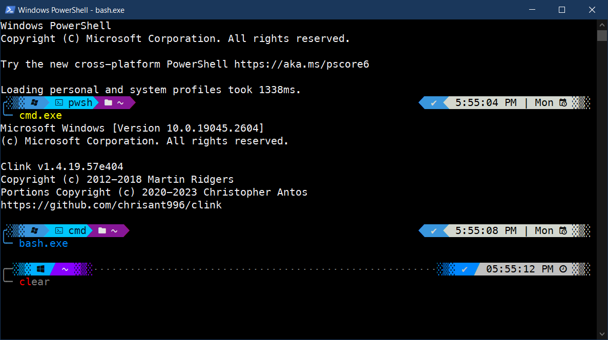

# PowerShell + Oh My Posh
## Final Look:

#

## Recommened:
01. `PowerShell 7+` Install from Microsoft Store
#

## Required:
01. [Nerd Font](https://www.nerdfonts.com/)
#

##  Oh My Posh

- Download and Install [Oh My Posh](https://ohmyposh.dev/)

    - Powershell Command to install 
    
        `winget install JanDeDobbeleer.OhMyPosh -s winget`

- Create a Profile for `oh my posh`

    - Powershell Command

        `notepad $PROFILE`
    - Adding the line 

        `oh-my-posh init pwsh --config "C:\Users\AIIH\AppData\Local\Programs\oh-my-posh\themes\powerlevel10k_rainbow.omp.json" | Invoke-Expression`
        
        note: replace `AIIH` using your user name.

- Close & Open Powershell Terminal.
#
## Modules:
01. TERMINAL-ICONS

	A. Installation:
	- Powershell Command
	* `Install-Module -Name Terminal-Icons -Repository PSGallery`

	B. Create a Profile for `Terminal-Icons`

    - Powershell Command

		`notepad $PROFILE`
    - Adding the line 

        `Import-Module -Name Terminal-Icons`
        
        note: replace `AIIH` using your user name.

02. PSReadLine Prediction

	A. Installation:
	- Powershell Command
	```code
	Install-Module PSReadLine -Force
	```

	B. Create a Profile for `PSReadLine`

    - Powershell Command

		`notepad $PROFILE`
    - Adding any line of below code.

		`Set-PSReadLineOption -EditMode Windows`

		`Set-PSReadLineOption -PredictionSource History`

		`Set-PSReadLineOption -PredictionViewStyle ListView`

		`Set-PSReadLineOption -PredictionViewStyle InlineView`

#

## MY Themes
- Customize Profile for `oh my posh` using `clink` on `cmd`

    - Download the `.json` files

        `absolute.omp.json`

        `powerlevel10k_rainbow.omp.json`

    - Navigate the file explorer

        `C:/Users/AIIH/AppData/Local/Programs/oh-my-posh/themes/`
        
        note: replace `AIIH` using your user name.

    - Paste all the `.json` files.

- Close & Open Command Prompt.

#
