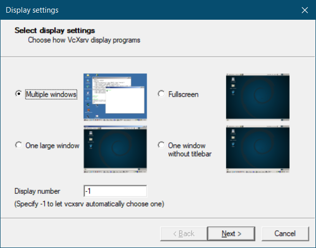
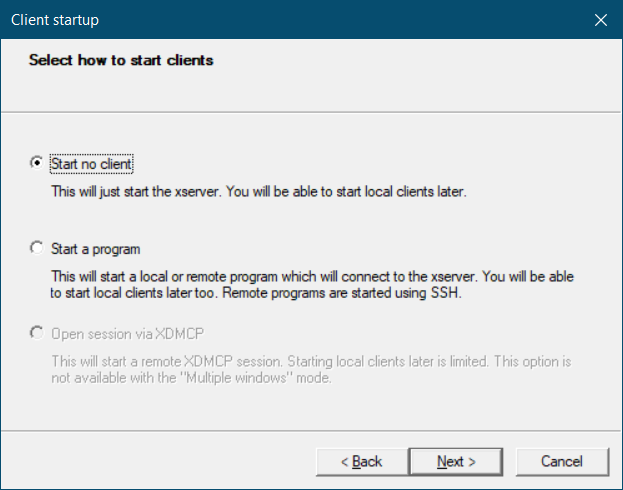
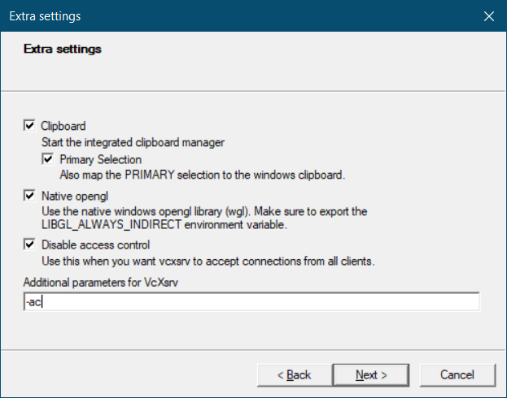
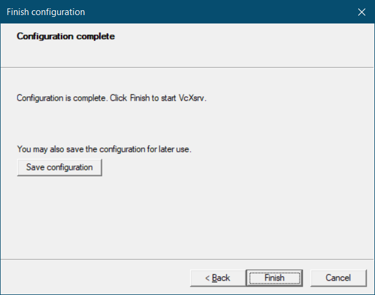
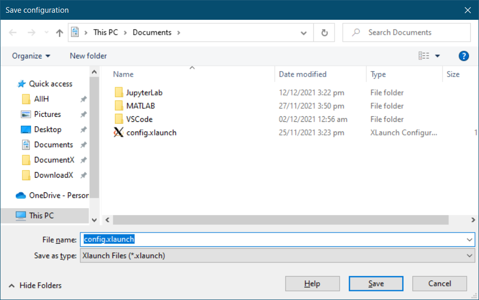
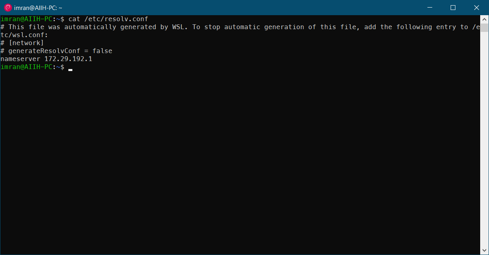
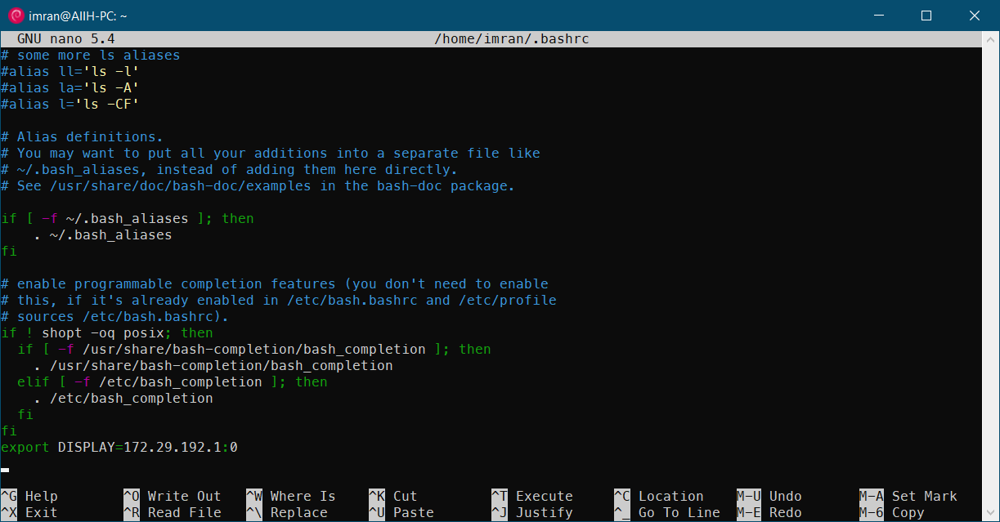
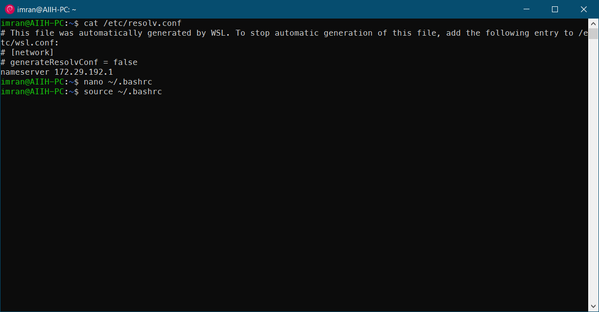
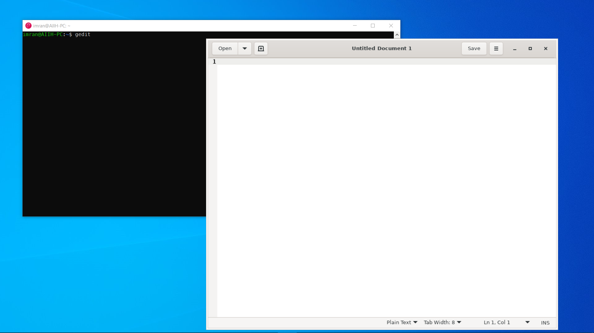

# Linux GUI on Windows 10
## 01. First-time Step-Up on `VcXsrv`:
First time after installing the `VcXsrv` on Windows 10. Following procedure required.
* Installed `VcXsrv Windows X Server`
* Open `VcXsrv` and following the Setting

* `Save configuration` 

* `Save and Finish`

## 02. After Reboot The Windows 10
Every startup time, you have to manually connect the WSL distro to the server. 
note : If you follow the first method. [Skip this]
* run the `config.xlaunch` file using double click.
## 03. Connect WSL to the VcXsrv Server
* open `Debian` or Other WSL installed distro.

* $ `cat /etc/resolv.conf`
* copy  the nameserver from the terminal like this : `172.29.192.1`

* $ `nano ~/.bashrc`
* adding the  line : `export DISPLAY=172.29.192.1:0`

* to reload the bashrc : $ `source ~/.bashrc`

* $ `gedit`

